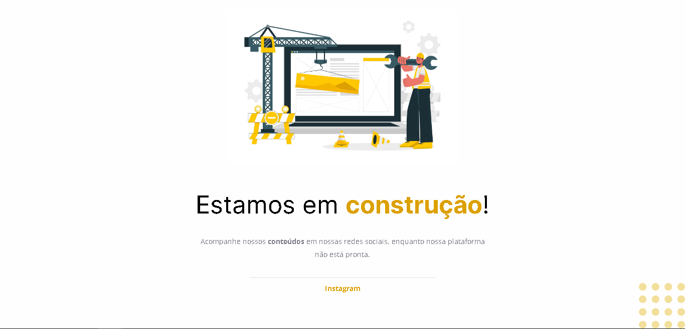

# Projeto "Página em Construção!"
### Retorno aos estudos de programação

Após um período parado, decidi retornar aos estudos de programação.
Apesar de ter maior interesse pela área de desenvolvimento BackEnd, decidi revisar e práticar alguns conceitos básicos do desenvolvimento FrontEnd.

### O que foi utilizado:
- HTML e CSS
- Alinhamento e Posicionamento
- Tags básicas do HTML
- Estilização básica com CSS

## RESULTADO

